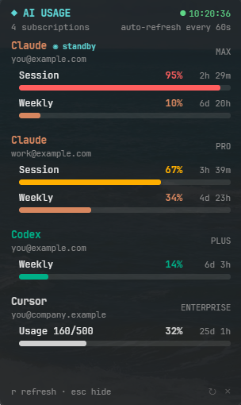
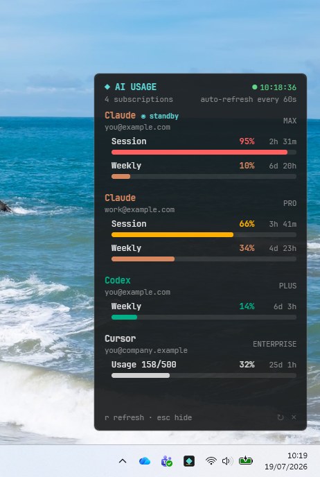

# AI Usage Monitor

Native desktop widget for **Windows and macOS** (Tauri) that pins the usage limits of multiple **Claude**, **Codex**, and **Cursor Business** accounts to the corner of your screen — always on top, out of the taskbar/Dock, and starting with the system.

It began as a terminal dashboard (TUI) and grew into the native app, which is now the primary way to use it. Accounts are added straight from the widget (which detects the credentials already on the machine); the Python collector — no external dependencies — offers the same setup from the terminal and doubles as a standalone dashboard.

<p align="center">
  
  &nbsp;&nbsp;
  
</p>

<p align="center"><em>Screenshots use sample account data; the usage figures are real.</em></p>

## Desktop widget (Windows & macOS)

Native Tauri v2 app (`widget/`; WebView2 on Windows, WKWebView on macOS):

- **Window**: borderless, always on top, out of the taskbar (Windows) / without a Dock icon and visible on every Space (macOS), pinned to the bottom-right corner. Starts hidden (no white flash) and is repositioned on every show.
- **Tray**: boots with just the tray/menu-bar icon. Left click toggles the widget; right click → "Quit".
- **Always fresh**: automatic background refresh with a spinner; `r` or the `↻` button force a refresh; `q`/`Esc`/`✕`/Alt+F4 hide to the tray.
- **Notifications**: a native notification as a limit rises through each configured threshold (default `80, 90, 95, 98, 100`% — see [Notification thresholds](#notification-thresholds)) — once per level, re-arming only after usage drops back below it.
- **Start on login**: the autostart entry (registry Run entry on Windows, LaunchAgent on macOS) is enabled on the first run of a release build.

Each provider uses its brand color (Claude coral, OpenAI green, Cursor white) and is identified by the account's real email. With more than one Claude account, the ones **not in use** get a cyan `◉ STANDBY` marker — the account in use is the one the Claude Code CLI is logged into, detected across environments (Windows and WSL alike), falling back to the open 5h session window when no CLI login is found. An external launcher or router can optionally publish `~/.config/ai-usage-monitor/claude-active-account.json` with `email` and Unix `updated_at`; a fresh hint takes precedence for one 5h window, and the app otherwise keeps its normal detection. Limits show up as `Session` (5h window) and `Weekly` (7-day window).

Build and implementation details: [`widget/README.md`](widget/README.md).

## How it works

The widget is **self-contained**: collection runs in Rust inside the app itself — no WSL, no Python, no external processes.

```
Tauri (Rust) → native collector → Claude, Codex, and Cursor APIs
```

Credentials live in `~/.config/ai-usage-monitor/` (`%USERPROFILE%\.config\ai-usage-monitor\` on Windows), in the same format the Python collector uses — both read the same store. Since the limits are server-side, the numbers are identical no matter where the read happens.

To diagnose collection without opening the window:

```powershell
ai-usage-widget.exe --probe   # Windows: prints the collected JSON and exits
```

```bash
"/Applications/AI Usage Widget.app/Contents/MacOS/ai-usage-widget" --probe   # macOS
```

## Terminal dashboard (optional)

The Python collector (`cli/usage_monitor.py`) runs straight in the terminal, on macOS, Linux/WSL, or Windows, and is also what registers the credentials:

```bash
ai-usage doctor   # check the configuration
ai-usage once     # a single reading (use --json for JSON output)
ai-usage watch    # live, responsive TUI with automatic refresh
```

On Windows, call it through Python (`python cli\usage_monitor.py <command>`). `watch` requires the `curses` module, which Windows Python does not ship — use `once` or the widget there.

In the TUI: `r` refreshes, `q` quits. Notifications apply here too, on the same thresholds as the widget (see below):

```bash
ai-usage watch --alert 90   # override config.json: alert from 90% up only
ai-usage watch --alert 0    # turn notifications off
```

Outside WSL/Windows the notification is a silent no-op.

## Notification thresholds

Both the widget and the TUI notify as a limit rises through each level in
`~/.config/ai-usage-monitor/config.json` (`%USERPROFILE%\.config\ai-usage-monitor\config.json` on Windows), created with the defaults on first run:

```json
{
  "alert_thresholds": [80, 90, 95, 98, 100]
}
```

Each level fires once and re-arms only after usage falls a few points below it, so a limit parked on a boundary is not re-announced every refresh. A window renewal drops usage to ~0, re-arming every level. Edit the list to change the levels (values outside 1–100 are ignored; an empty or unusable list falls back to the defaults). `ai-usage doctor` prints the levels in effect.

## Setting up accounts

### In the widget

Press `a` (or the `⚙` button) to open the accounts view:

- **Claude**: the widget detects the logins already on the machine — macOS Keychain entries (one per Claude Code config dir, including custom `CLAUDE_CONFIG_DIR` setups) and `~/.claude*/.credentials.json` files — and registers one per click. Sources whose account is already registered are hidden; adding reads the credential (macOS asks for permission), identifies the account, and names the profile after its email.
- **Codex**: nothing to set up — detected automatically through the Codex CLI.
- **Cursor**: enter the Admin API key (plus your email) or the dashboard cookie directly in the form.

The CLI commands below do the same from the terminal and remain the only path on headless setups.

### Two Claude accounts

Without changing the default authentication or disturbing open sessions:

```bash
ai-usage claude-login claude-2 --email second-account@example.com
```

The command uses an empty temporary profile, imports the session, and removes the temporary one when done.

Alternatively, to capture the currently active default session (repeat for each account):

```bash
claude auth login
ai-usage claude-add claude-1
```

Profiles are kept separate under `~/.config/ai-usage-monitor/claude/`, with private permissions. The monitor refreshes each profile's tokens independently.

### Cursor Business

Preferred option for team administrators:

```bash
ai-usage cursor-admin --email your-email@company.com
```

The key is read from a hidden prompt. You can create one in Cursor Dashboard → Settings → Admin API Keys.

Without admin permission, use the dashboard's `WorkosCursorSessionToken` cookie:

```bash
ai-usage cursor-cookie
```

That alternative relies on the dashboard's internal endpoint and may need adjusting if Cursor changes it.

## Security

- Tokens, cookies, and keys never appear in the dashboard or in process arguments.
- Config directories use `0700` permissions; credential files use `0600`.
- Do not copy credentials into chats, issues, or repositories.

## License

MIT — see [LICENSE](LICENSE).
